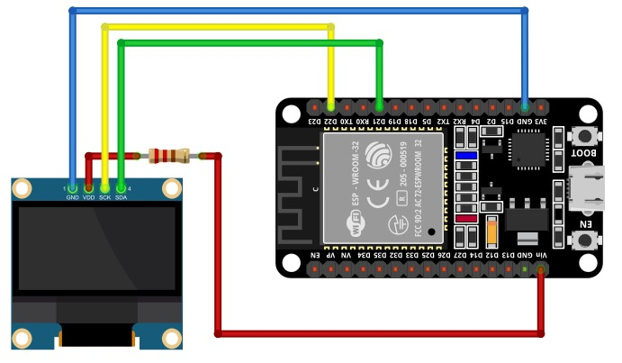

# Aplicaciones IoT

## Placa de desarrollo implementada

### DOIT ESP32 DEVKIT V1

La tarjeta DOIT ESP32 DevKit V1 es una placa de desarrollo basada en el chip ESP32 de Espressif Systems
Destaca por su potente microcontrolador de dos núcleos, esta característica permite que el dispositivo funcione con mayor eficiencia y rendimiento. Adicionalmente, este microcontrolador de bajo costo y alto rendimiento combina Wi-Fi y Bluetooth en un solo chip, lo que lo hace ideal para una amplia gama de aplicaciones de IoT (Internet de las cosas) y proyectos de desarrollo. Su principal característica es la integración del protocolo de comunicación inalámbrica ESP-NOW, que permite la comunicación directa entre dispositivos ESP32 sin necesidad de un enrutador Wi-Fi.

### Hadware

Para realizar el montaje físico es necesario el display OLED ssd1306 de 128X64, en donde se conectan los pines VCC y GND a las respectivas
fuentes de alimentación; los 2 pines restante de la OLed se conectan al pin GPIO22 para la señal SCL (Serial Clock) y otro al pin GPIO21 para la señal SDA (Serial Data), para la conexión a la fuente de alimentación se utiliza una resistencia de protección de 330Ω.

## SOFTWARE

### FINALIDAD

El código presentado muestra un ejemplo de como configurar una display OLED ssd1306, mediante la configuración de un sistema de 
comunicación I2C, en donde se establecen los pines GPIO22 y GPIO21 como SCL y SDA respectivamente, se define una matriz llamada 
image_data, en donde se representa una imagen con el logo de la universidad autonoma de manizales por medio de los bytes de la 
display OLED, está se muestra durante 5 segundos, posteriormente la display ess limpieda para relizar la escritura de 2 
palabras ("HOLA", "MUNDO"), el objetivo principal es demostrar el funcionamiento de la display OLED y su capacidad para mostrar 
contenido gráfico y texto, lo que podría ser utilizado en una variedad de aplicaciones, como dispositivos de visualización de información en tiempo real o sistemas de control con interfaz de usuario.

### ESTRUCTURA

Este código en lenguaje c utiiza bibliotecas estándar, , stdio, stdlib, FreeRTOS y ssd1306 paraimplementar la configuración de un sistema de comunicación I2C en una display OLED ssd1306. Comienza incluyendo las bibliotecas necesarias y definiendo constantes. La función principal (app_main) realiza la configuración inicial de la comunicación I2C y el dispositivo SSD1306, mostrando una imagen en la display OLED durante 5 segundos, luego borrando la pantalla y escribiendo las palabras "HOLA MUNDO" en ella. Finalmente, se actualiza la display para reflejar estos cambios, lo que resulta en la visualización de la imagen y el texto en la display OLED de acuerdo con el flujo de ejecución programado.

