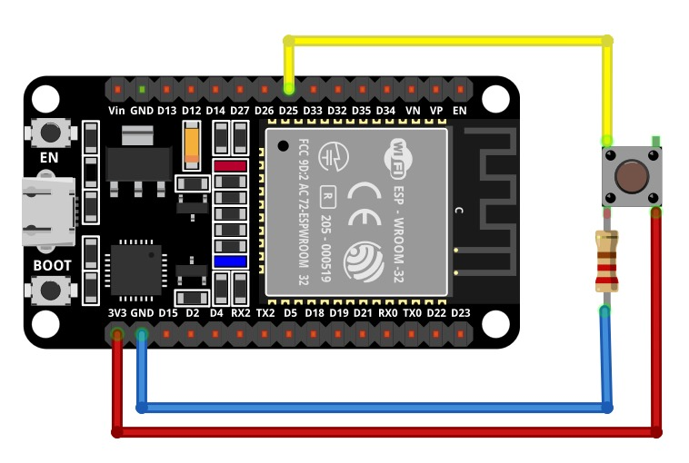

# Aplicaciones IoT

## Placa de desarrollo implementada

### DOIT ESP32 DEVKIT V1

La tarjeta DOIT ESP32 DevKit V1 es una placa de desarrollo basada en el chip ESP32 de Espressif Systems
Destaca por su potente microcontrolador de dos núcleos, esta característica permite que el dispositivo funcione con mayor eficiencia y rendimiento. 
Adicionalmente, este microcontrolador de bajo costo y alto rendimiento combina Wi-Fi y Bluetooth en un solo chip, lo que lo hace ideal para una amplia gama de aplicaciones de IoT (Internet de las cosas) y proyectos de desarrollo. Su principal característica es la integración del protocolo de comunicación inalámbrica ESP-NOW, que permite la comunicación directa entre dispositivos ESP32 sin necesidad de un enrutador Wi-Fi.

### Hadware

Para realizar el montaje físico es necesario el display OLED ssd1306 de 128X64, en donde se conectan los pines VCC y GND a las respectivas
fuentes de alimentación; los 2 pines restante de la OLed se conectan al pin GPIO22 para la señal SCL (Serial Clock) y otro al pin GPIO21 para la señal SDA (Serial Data), para la conexión a la fuente de alimentación se utiliza una resistencia de protección de 330Ω; adicionalmente se requiere un pulsador, en donde uno de sus pines esta conectado a VCC, otro a GND por medio de una resistencia de 330Ω y otro al pin GPIO25.

## SOFTWARE

### FINALIDAD

El código presentado muestra un ejemplo de como configurar una pantalla OLED ssd1306, mediante la configuración de un sistema de 
comunicación I2C, en donde se establecen los pines GPIO22 y GPIO21 como SCL y SDA respectivamente. Adicionalmente se conecta un pulsador mediante el pin GPIO25, el porposito es que al ser presionado el pulsador (alto), se realice la escritura del mensaje "1" en el display OLED y por el contarrio cuando no este presionado se realice la escritura del mesnaje "0" en el display OLED.

### ESTRUCTURA

Este código en lenguaje c utiiza bibliotecas estándar, , stdio, stdlib, FreeRTOS y ssd1306 paraimplementar la configuración de un sistema de comunicación I2C en una pantalla OLED ssd1306. Comienza incluyendo las bibliotecas necesarias y definiendo constantes. La función principal (app_main) configura un pin GPIO como entrada para un pulsador, establece la comunicación I2C para controlar el display OLED SSD1306, y luego entra en un ciclo while infinito. Dentro del ciclo, lee el estado del pulsador, actualiza el display OLED para mostrar "1" si el pulsador está presionado o "0" si no lo está, y luego refresca físicamente el display. El bucle se repite continuamente con una pausa de 500 milisegundos, lo que permite que el programa monitoree el estado del pulsador y actualice el displaya en tiempo real.La tarea configurar_pines configura el pin GPIO25 específico en el ESP32 como entrada y habilita una resistencia pull-up interna, preparándolo para la lectura del estado de un pulsador en el programa principal al deshabilitar interrupciones, establecerlo en modo de entrada y aplicar la configuración. .La tarea leer_pulsador se encarga de leer el estado del pulsador conectado al pin GPIO25 y retorna ese estado como un valor booleano. Si el pulsador está presionado o en un estado alto, la función devolverá q, y si el pulsador no está presionado o en un estado bajo, la función devolverá 0.

