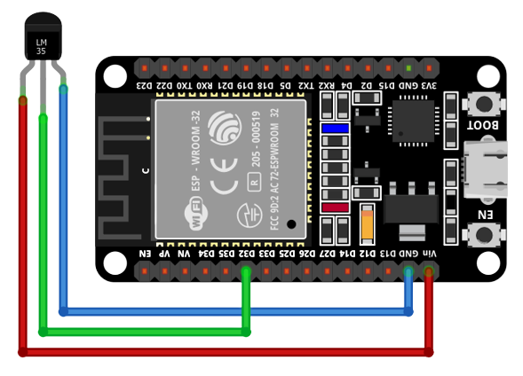

# Aplicaciones IoT

## Placa de desarrollo implementada

### DOIT ESP32 DEVKIT V1

La tarjeta DOIT ESP32 DevKit V1 es una placa de desarrollo basada en el chip ESP32 de Espressif Systems
Destaca por su potente microcontrolador de dos núcleos, esta característica permite que el dispositivo funcione con mayor eficiencia y rendimiento. 
Adicionalmente, este microcontrolador de bajo costo y alto rendimiento combina Wi-Fi y Bluetooth en un solo chip, lo que lo hace ideal para una amplia gama de aplicaciones de IoT (Internet de las cosas) y proyectos de desarrollo. Su principal característica es la integración del protocolo de comunicación inalámbrica ESP-NOW, que permite la comunicación directa entre dispositivos ESP32 sin necesidad de un enrutador Wi-Fi.

### Hadware

Para realizar el montaje físico es necesario el sensor LM35, el cual es conectado a la arjeta ESP32, uniendo los pines GND y VCC del LM35 a las respectivas fuentes de alimentación, y conectando el pin de salida del LM35 a un pin GPIO12. Luego, aseguras la conexión de la fuente de alimentación a GND y 5V, y enlazas los pines GND y 5V del ESP32. 

## SOFTWARE

### FINALIDAD

El código presentado muestra un ejemplo de cómo controlar un LED utilizando un microcontrolador ESP32 y el sistema operativo FreeRTOS. Define dos funciones: init_led para inicializar el pin GPIO del LED y toggle_led para alternar su estado. La función principal app_main inicializa el LED, entra en un bucle infinito donde alterna el estado del LED y espera 3 segundos entre cada cambio. Este programa permite que el LED parpadee a intervalos regulares, controlado por el sistema operativo en tiempo real. Para lograr esto, es importante realizar un montaje adecuado, conectando el ánodo del LED a una resistencia y al pin GPIO especificado en el código, y el cátodo del LED a tierra.

### ESTRUCTURA

Este código en lenguaje C utiliza bibliotecas estándar y FreeRTOS para utilizar un sensor LM35 en un ESP32. Comienza incluyendo las bibliotecas necesarias y definiendo constantes, luego declara prototipos de funciones. La función principal (app_main) se encarga de configurar el ADC y de crear la tarea lm35_task para llevar a cabo la lectura continua de la temperatura. La función lm35_task se encraga de leer los datos de temperatura del sensor, empleando la configuración y calibración del convertidor analógico-digital (ADC) para obtener mediciones precisas. La señal del sensor LM35 es convertida en milivoltios y, a continuación, traducida en temperaturas en grados Celsius considerando la sensibilidad del sensor (10 mV/°C). La temperatura resultante es impresa en la consola, y el programa se pausa durante un segundo antes de efectuar la próxima lectura

