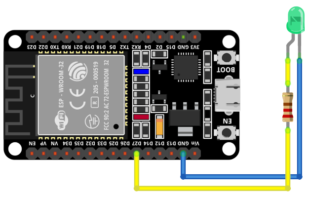

# APLICACIONES IOT

## Placa de desarrollo implementada

### DOIT ESP32 DEVKIT V1

La tarjeta DOIT ESP32 DevKit V1 es una placa de desarrollo basada en el chip ESP32 de Espressif Systems
Destaca por su potente microcontrolador de dos núcleos, esta característica permite que el dispositivo funcione con mayor eficiencia y rendimiento. 
Adicionalmente, este microcontrolador de bajo costo y alto rendimiento combina Wi-Fi y Bluetooth en un solo chip, lo que lo hace ideal para una amplia gama de aplicaciones de IoT (Internet de las cosas) y proyectos de desarrollo. Su principal característica es la integración del protocolo de comunicación inalámbrica ESP-NOW, que permite la comunicación directa entre dispositivos ESP32 sin necesidad de un enrutador Wi-Fi.

### Hadware

Para realizar el montaje físico correspondiente al programa proporcionado, se requiere conectar un LED a un pin GPIO 27 específico en un microcontrolador ESP32. Esta conexión implica conectar el ánodo del LED a una resistencia, cuyo otro extremo se conecta al pin GPIO 27 definido en el código, mientras que el cátodo del LED se conecta al voltaje de tierra del ESP32. 

## SOFTWARE

### FINALIDAD

El código presentado muestra un ejemplo de cómo controlar un LED utilizando un microcontrolador ESP32 y el sistema operativo FreeRTOS. Define dos funciones: init_led para inicializar el pin GPIO del LED y toggle_led para alternar su estado. La función principal app_main inicializa el LED, entra en un bucle infinito donde alterna el estado del LED y espera 3 segundos entre cada cambio. Este programa permite que el LED parpadee a intervalos regulares, controlado por el sistema operativo en tiempo real. Para lograr esto, es importante realizar un montaje adecuado, conectando el ánodo del LED a una resistencia y al pin GPIO especificado en el código, y el cátodo del LED a tierra.

### ESTRUCTURA

Este código en lenguaje C utiliza bibliotecas estándar y FreeRTOS para controlar un LED en un ESP32. Comienza incluyendo las bibliotecas necesarias y definiendo constantes, luego declara prototipos de funciones. La función principal (app_main) inicializa el LED, entra en un bucle infinito donde alterna el estado del LED y muestra su estado en la consola cada segundo. Las funciones init_led y toggle_led controlan la configuración y el cambio de estado del LED, respectivamente. En conjunto, el programa demuestra cómo programar multitareas y controlar pines GPIO en tiempo real con FreeRTOS en un microcontrolador ESP32.